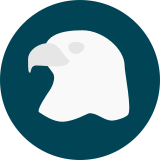

# Eagle Monitoring Framework

[/statusIcon)](http://build.craftworkgames.com/viewType.html?buildTypeId=EagleMonitoring_EagleMonitoringCi&guest=1)

An open source application monitoring framework for .NET applications

The task board is on [Trello](https://trello.com/b/XIFbVHWD/eagle-monitoring-framework)

